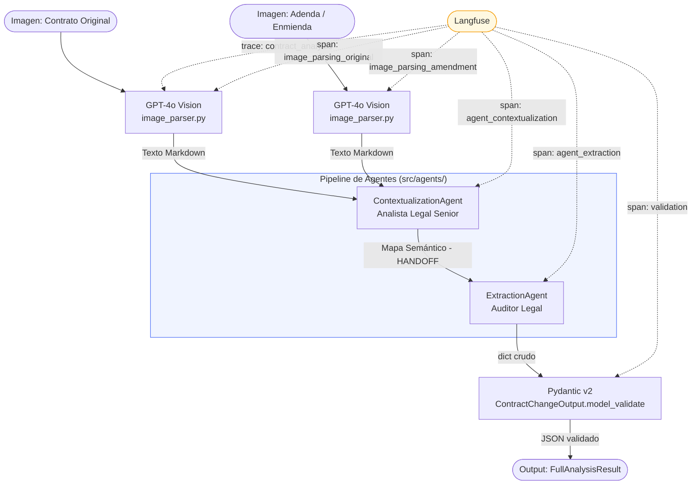

# LegalMove — Sistema de Análisis Multimodal de Cambios Contractuales

Sistema de inteligencia artificial que analiza pares de imágenes de contratos legales (contrato original + adenda) y extrae de forma estructurada todos los cambios detectados: cláusulas modificadas, eliminadas y nuevas, con evaluación de riesgo legal. El pipeline es completamente observable mediante trazas jerárquicas en Langfuse.

---

## Diagrama de Arquitectura



**Flujo de datos:**
1. Las imágenes PNG/JPG de los contratos se codifican en Base64 y se envían a GPT-4o Vision.
2. El texto extraído (en Markdown estructurado) se pasa al `ContextualizationAgent`.
3. El agente 1 produce un **mapa semántico** comparativo que identifica cada cláusula y su estado.
4. Ese mapa es el **handoff** al `ExtractionAgent`, que produce el JSON final.
5. Pydantic v2 valida el dict contra el schema `ContractChangeOutput`.
6. Langfuse registra cada etapa como un span hijo de la traza principal.

---

## Stack Tecnológico

| Tecnología | Versión | Justificación técnica |
|---|---|---|
| **Python** | 3.11+ | Tipado estático con `TypeAlias` y `type union` (`X \| Y`), `match` statements y mejor rendimiento en el intérprete. |
| **OpenAI GPT-4o Vision** | API v1 | Capacidad multimodal nativa: procesa imágenes directamente sin OCR previo. Superior en documentos legales con tablas, firmas y formatos complejos donde el OCR tradicional pierde contexto semántico. |
| **LangChain** | >=0.2.0 | Orquestación de agentes con chains tipadas (`prompt \| llm \| parser`). Permite composición declarativa del flujo de cada agente y reemplazo de componentes sin cambiar la lógica de negocio. |
| **Pydantic v2** | >=2.7.0 | Validación estricta de schemas con `ConfigDict(strict=True)`. `model_validate()` convierte el dict crudo del LLM en un objeto tipado, rechazando outputs malformados antes de que lleguen al usuario. |
| **Langfuse** | >=2.36.0 | Observabilidad nativa del pipeline con spans jerárquicos. Permite auditar cada llamada al LLM, medir latencia por etapa y rastrear trazas completas por análisis. Esencial para debugging en producción y cumplimiento de auditoría legal. |
| **python-dotenv** | >=1.0.0 | Gestión segura de secrets: las API keys nunca se hardcodean en el código fuente. Carga automática desde `.env` sin configuración adicional. |

---

## Estructura del Proyecto

```
proyecto-m4-ludwing/
├── src/
│   ├── __init__.py
│   ├── main.py                          # CLI entry point: orquesta el pipeline con Langfuse
│   ├── image_parser.py                  # Parseo de imágenes con GPT-4o Vision (Base64 + retry)
│   ├── models.py                        # Schemas Pydantic: ClauseChange, ContractChangeOutput, FullAnalysisResult
│   └── agents/
│       ├── __init__.py
│       ├── contextualization_agent.py   # Agente 1: Analista Legal Senior — genera el mapa semántico
│       ├── extraction_agent.py          # Agente 2: Auditor Legal — extrae JSON estructurado
│       └── pipeline.py                  # ContractAnalysisPipeline: orquesta el handoff entre agentes
├── data/
│   └── test_contracts/
│       ├── par1_contrato_original.png   # Par de prueba 1: cambios simples
│       ├── par1_adenda.png
│       ├── par2_contrato_original.png   # Par de prueba 2: cambios complejos
│       ├── par2_adenda.png
│       └── README.md                    # Descripción de los contratos de prueba
├── scripts/
│   └── generate_test_contracts.py       # Script auxiliar para generar nuevos contratos de prueba
├── context/
│   ├── 01-contexto-objetivos.md
│   ├── 02-entregables.md
│   ├── 03-defensa-vivo.md
│   ├── 04-recursos-adicionales.md
│   └── 05-rubrica-evaluacion.md
├── requirements.txt                     # Dependencias del proyecto
├── .env.example                         # Template de variables de entorno requeridas
└── README.md                            # Este archivo
```

---

## Setup e Instalación

**Requisitos previos:** Python 3.11 o superior instalado en el sistema.

**Paso 1 — Clonar el repositorio**

```bash
git clone <url-del-repositorio>
cd proyecto-m4-ludwing
```

**Paso 2 — Crear y activar el entorno virtual**

```bash
python -m venv .venv
source .venv/bin/activate        # Linux / macOS
# .venv\Scripts\activate         # Windows PowerShell
```

**Paso 3 — Instalar dependencias**

```bash
pip install -r requirements.txt
```

**Paso 4 — Configurar variables de entorno**

```bash
cp .env.example .env
# Editar .env con tus credenciales reales (ver sección "Variables de entorno")
```

**Paso 5 (Opcional) — Generar contratos de prueba adicionales**

```bash
python scripts/generate_test_contracts.py
```

Los contratos de prueba incluidos en `data/test_contracts/` ya están listos para usar sin este paso.

---

## Uso

### Comando básico

```bash
python -m src.main <imagen_original> <imagen_adenda>
```

### Ejemplos

```bash
# Par 1 — cambios simples (penalidades y plazos)
python -m src.main data/test_contracts/par1_contrato_original.png data/test_contracts/par1_adenda.png

# Par 2 — cambios complejos (múltiples cláusulas, inclusión y eliminación)
python -m src.main data/test_contracts/par2_contrato_original.png data/test_contracts/par2_adenda.png

# Especificar modelo alternativo
python -m src.main data/test_contracts/par1_contrato_original.png data/test_contracts/par1_adenda.png --model gpt-4o

# Guardar resultado en archivo JSON
python -m src.main data/test_contracts/par1_contrato_original.png data/test_contracts/par1_adenda.png --output resultado.json

# Pipeline completo con modelo y archivo de salida
python -m src.main imagen1.png imagen2.png --model gpt-4o --output analisis.json
```

### Opciones del CLI

| Argumento | Descripción | Valor por defecto |
|---|---|---|
| `original_image` | Path a la imagen del contrato original (PNG, JPG, JPEG, WEBP, GIF) | Requerido |
| `amendment_image` | Path a la imagen de la adenda o enmienda | Requerido |
| `--model` | Modelo OpenAI a utilizar | `gpt-4o` |
| `--output FILE` | Archivo donde guardar el resultado JSON. Si se omite, imprime en stdout | stdout |

### Formato de salida

```json
{
  "metadata": {
    "original_file": "data/test_contracts/par1_contrato_original.png",
    "amendment_file": "data/test_contracts/par1_adenda.png",
    "processing_date": "2026-05-21T17:35:18+00:00",
    "total_changes": 2,
    "model_used": "gpt-4o"
  },
  "analysis": {
    "summary_of_changes": "Se detectaron 2 cambios...",
    "modified_clauses": [
      {
        "clause_id": "3.1",
        "clause_title": "Penalidades por incumplimiento",
        "original_text": "La penalidad será del 5% mensual.",
        "amended_text": "La penalidad será del 10% mensual.",
        "change_type": "modified",
        "significance": "high"
      }
    ],
    "risk_assessment": "El aumento de la penalidad..."
  }
}
```

---

## Arquitectura de Agentes

### Por qué dos agentes y no uno

Un único agente que intente a la vez entender la estructura del contrato Y extraer los cambios en JSON sufre de **sobrecarga cognitiva**: produce más alucinaciones, pierde cláusulas en documentos largos y genera JSON inconsistente. La separación en dos agentes especializados aplica el principio de **separación de responsabilidades**:

- El agente 1 trabaja con libertad narrativa para explorar el documento y construir un mapa comprensivo.
- El agente 2 recibe ese mapa como fuente de verdad y solo necesita traducirlo al schema JSON, sin re-analizar el documento.
- El agente 2 **valida implícitamente** el trabajo del agente 1: si el mapa tiene errores, el JSON reflejará inconsistencias que Pydantic rechazará, haciendo el error detectable.

### ContextualizationAgent — Analista Legal Senior

**Archivo:** `src/agents/contextualization_agent.py`

**Rol:** Analista Legal Senior con más de 20 años de experiencia en derecho contractual.

**Qué hace:**
1. Recibe los textos completos del contrato original y la adenda (extraídos por `image_parser.py`).
2. Cataloga cada cláusula del contrato original con su `id`, `título`, `resumen` y `tipo`.
3. Compara cláusula por cláusula contra la adenda, marcando cada una como `MODIFICADA`, `ELIMINADA` o `SIN CAMBIOS`, e identificando cláusulas `NUEVAS`.
4. Genera una sección de "Cláusulas Prioritarias" ordenadas por impacto.

**Qué produce:** Un **mapa semántico** en Markdown bien estructurado. Este string es el **handoff** al segundo agente.

**Por qué este rol:** El prompt de sistema con identidad de experto legal mejora la calidad del análisis estructural. La temperatura `0.0` garantiza salidas deterministas, crítico para auditoría.

### ExtractionAgent — Auditor Legal

**Archivo:** `src/agents/extraction_agent.py`

**Rol:** Auditor Legal con especialización en análisis de enmiendas contractuales.

**Qué recibe (handoff):** El mapa semántico completo del `ContextualizationAgent` + los textos originales de ambos documentos.

**Qué hace:**
1. Usa el mapa semántico como fuente de verdad primaria (no re-analiza el documento desde cero).
2. Extrae los fragmentos literales exactos de cada cláusula afectada consultando los textos originales.
3. Asigna nivel de significancia (`high`/`medium`/`low`) basándose en la priorización del Analista.
4. Produce un único objeto JSON que cumple el schema `ContractChangeOutput`.

**Qué produce:** Un `dict` Python listo para ser validado con `ContractChangeOutput.model_validate()`.

**Por qué este rol:** El segundo agente actúa como auditor que verifica el trabajo del analista, reduciendo errores de omisión. El JSON output estructurado es validado por Pydantic antes de llegar al usuario.

### Flujo de Handoff

```
ContextualizationAgent.analyze(original_text, amendment_text)
    → semantic_map: str  ← HANDOFF (Markdown con mapa semántico)
        ↓
ExtractionAgent.extract(original_text, amendment_text, semantic_map)
    → raw_result: dict
        ↓
ContractChangeOutput.model_validate(raw_result)
    → validated_output: ContractChangeOutput
```

---

## Modelo de Salida

### `ContractChangeOutput` (schema principal)

| Campo | Tipo | Descripción |
|---|---|---|
| `summary_of_changes` | `str` | Resumen ejecutivo de todos los cambios detectados (2-4 oraciones). |
| `modified_clauses` | `list[ClauseChange]` | Lista de cada cambio con detalle por cláusula. |
| `risk_assessment` | `str` | Evaluación del impacto legal y riesgos derivados (3-6 oraciones). |

### `ClauseChange` (elemento de `modified_clauses`)

| Campo | Tipo | Valores posibles | Descripción |
|---|---|---|---|
| `clause_id` | `str` | `"3.1"`, `"5.2.a"` | Identificador jerárquico de la cláusula. |
| `clause_title` | `str` | — | Nombre descriptivo de la cláusula. |
| `original_text` | `str` | — | Texto literal en el contrato original; vacío si la cláusula es nueva. |
| `amended_text` | `str` | — | Texto literal en la adenda; vacío si fue eliminada. |
| `change_type` | `Literal` | `"added"` / `"modified"` / `"removed"` | Tipo de cambio aplicado. |
| `significance` | `Literal` | `"high"` / `"medium"` / `"low"` | Nivel de impacto legal y económico. |

**Nota:** `ContractChangeOutput` usa `ConfigDict(strict=True)` — Pydantic rechaza tipos incorrectos sin coerción silenciosa.

---

## Observabilidad con Langfuse

Cada ejecución del pipeline crea una **traza padre** (`contract_analysis`) en Langfuse con **5 spans hijos** que capturan inputs, outputs y latencia de cada etapa:

```
Trace: contract_analysis
  ├── Span: image_parsing_original     → chars extraídos, preview del texto, latency_ms
  ├── Span: image_parsing_amendment    → chars extraídos, preview del texto, latency_ms
  ├── Span: agent_contextualization    → longitud del mapa semántico, preview, latency_ms
  ├── Span: agent_extraction           → claves del dict, count de modified_clauses, latency_ms
  └── Span: validation                 → total_changes, schema usado, latency_ms
```

### Métricas registradas por span

| Span | Input registrado | Output registrado | Metadata |
|---|---|---|---|
| `image_parsing_original` | `image_path` | `text_length`, `text_preview` | `chars_extracted`, `latency_ms` |
| `image_parsing_amendment` | `image_path` | `text_length`, `text_preview` | `chars_extracted`, `latency_ms` |
| `agent_contextualization` | previews de ambos textos | `semantic_map_length`, preview | `model`, `agent`, `latency_ms` |
| `agent_extraction` | longitudes + preview del mapa | `result_keys`, `modified_clauses_count` | `model`, `agent`, `latency_ms` |
| `validation` | `raw_result` | `total_changes`, `summary_preview` | `schema`, `validation`, `latency_ms` |

La traza padre acumula además el **desglose total de latencia** en ms por etapa para identificar cuellos de botella.

**Ver trazas:** Acceder a [cloud.langfuse.com](https://cloud.langfuse.com) con las credenciales configuradas en `.env`.

---

## Decisiones Técnicas

### Por qué GPT-4o Vision y no OCR tradicional

Los contratos legales tienen formatos complejos: tablas de penalidades, numeraciones jerárquicas anidadas, texto en múltiples columnas, marcas de agua, firmas y sellos. El OCR tradicional (Tesseract, AWS Textract) extrae caracteres pero pierde la **semántica estructural**: no sabe que "3.1.a)" es una sub-cláusula de "3.1" que pertenece a la sección "3. Obligaciones". GPT-4o Vision entiende el layout visual directamente y produce Markdown con jerarquía correcta, lo que permite al pipeline comparar cláusulas por su posición estructural, no solo por texto literal.

### Por qué Pydantic strict mode

`ConfigDict(strict=True)` desactiva la coerción de tipos de Pydantic. Sin esto, un LLM que devuelva `"3"` (string) en lugar de `3` (int) pasaría validación silenciosamente. En un sistema de análisis legal donde la precisión es crítica, cualquier tipo incorrecto debe fallar explícitamente con un error descriptivo que permita depuración inmediata, no silenciarse.

### Por qué Langfuse y no logging simple

El logging a archivo (`logger.info(...)`) registra eventos linealmente pero no captura la **jerarquía causal** entre etapas ni permite comparar runs distintos. Langfuse provee:
- Spans anidados que reflejan la estructura real del pipeline.
- Inputs y outputs completos almacenados por span (no solo mensajes de texto).
- UI para comparar latencias entre runs y detectar degradación del modelo.
- Trazabilidad por `trace_id` para reproducir cualquier análisis específico.

Para un pipeline de auditoría legal esto no es opcional: cada análisis debe ser reproducible y auditable.

### Por qué handoff explícito entre agentes

El `semantic_map` se pasa explícitamente como parámetro a `ExtractionAgent.extract()` en lugar de usar memoria compartida o estado global. Esto garantiza:
1. **Testabilidad:** cada agente puede ser testeado de forma aislada con fixtures.
2. **Reproducibilidad:** el mismo `semantic_map` producirá siempre el mismo output del extractor.
3. **Trazabilidad:** Langfuse registra el mapa completo en el span de extracción.
4. **Separación de estado:** no hay acoplamiento implícito entre agentes.

---

## Variables de Entorno Requeridas

| Variable | Descripción | Dónde obtenerla |
|---|---|---|
| `OPENAI_API_KEY` | API key de OpenAI para acceso a GPT-4o | [platform.openai.com/api-keys](https://platform.openai.com/api-keys) |
| `LANGFUSE_PUBLIC_KEY` | Public key del proyecto Langfuse | Dashboard de Langfuse → Settings → API Keys |
| `LANGFUSE_SECRET_KEY` | Secret key del proyecto Langfuse | Dashboard de Langfuse → Settings → API Keys |
| `LANGFUSE_HOST` | Endpoint de Langfuse (cloud o self-hosted) | `https://cloud.langfuse.com` (por defecto) |

Copiar `.env.example` a `.env` y completar los valores reales. El archivo `.env` nunca debe commitearse al repositorio.

---

## Licencia

MIT License — Copyright (c) 2026 Ludwing Rivera Amador
